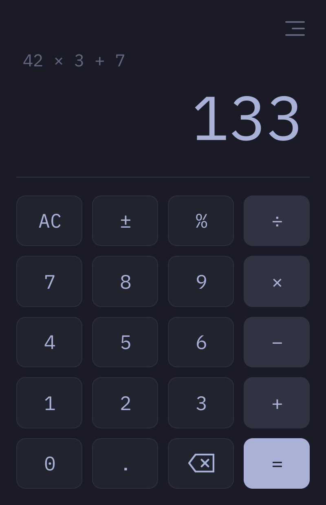

# Omacalc

A dead-simple calculator built with Qt Quick and C++ that automatically follows the Omarchy theme and system dark/light mode.




## Install

Install via the Omarchy Package Repository via the `omacalc` package.

## Usage

The keypad covers the basics: the four arithmetic operators with the usual
precedence (`×` and `÷` before `+` and `−`), decimals, percent, sign toggle,
and backspace. The expression builds up above the display and stays visible
with the result after `=`, so `42 × 3 + 7` reads back exactly as it was entered.

Percent applies to the running total: with a pending operator, `%` shows the
result immediately (`200 + 10 %` gives `220`, `200 × 10 %` gives `20`,
`200 ÷ 10 %` gives `2000`). On its own, `x %` simply divides by 100.

Everything works from the keyboard too:

- `0-9`, `.`, `+`, `-`, `*`, `/`, and `%` enter digits and operators.
- `Enter` or `=` calculates.
- `Backspace` deletes the last digit.
- `C` or `Escape` clears.
- `S` toggles the sign.
- `Ctrl+C` or `Super+C` copies the result.
- `Ctrl+V` or `Super+V` pastes a number.

Colors follow the current Omarchy theme (`~/.local/state/omarchy/current/theme/colors.toml`)
and re-tint live when the theme changes. Text follows the desktop text size —
`omarchy display text size`, or GNOME's `text-scaling-factor`.

## Configuration

Omacalc reads display preferences from `~/.config/Omacom/omacalc.conf`:

```ini
[display]
decimalSeparator=comma
fixedDecimalPlaces=2
```

- `decimalSeparator` accepts `dot` (default) or `comma`, so numbers can be
  typed and displayed with either an English or a Brazilian-style decimal
  point. A quoted `","` also works, but Qt's INI parser treats a bare,
  unquoted `,` as a list separator and silently drops it — use `comma` to
  avoid that pitfall. All internal parsing and math stay locale-independent;
  only the digits shown to the user and the decimal key label change.
- `fixedDecimalPlaces` is optional. When set, any calculation result that
  isn't a whole number is shown with exactly that many decimal places, e.g.
  `fixedDecimalPlaces=2` turns `10 ÷ 3` into `3.33`. Whole-number results such
  as `4 + 6` still show as `10`. Leave it unset to keep the default, shortest
  round-trip formatting.

## Requirements

- Qt 6: `qt6-base`, `qt6-declarative`
- `xdg-desktop-portal` and a portal backend

The iA Writer Mono font is bundled under the SIL Open Font License 1.1; see
`fonts/OFL.txt`. The font is copyright Information Architects Inc. and based on
IBM Plex, copyright IBM Corp.
